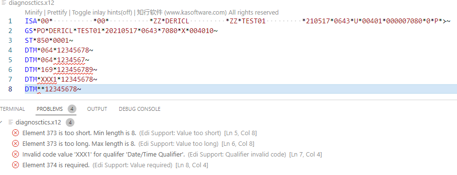
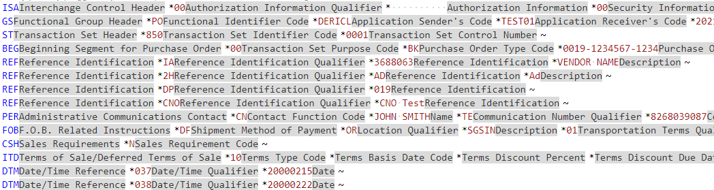
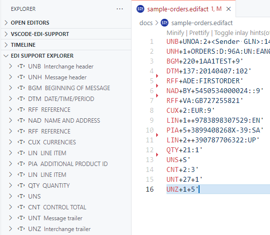
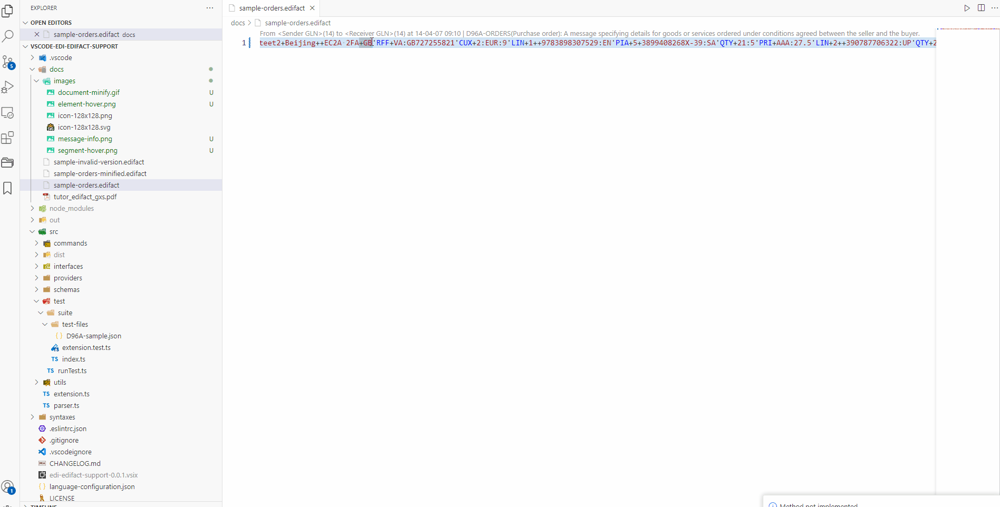
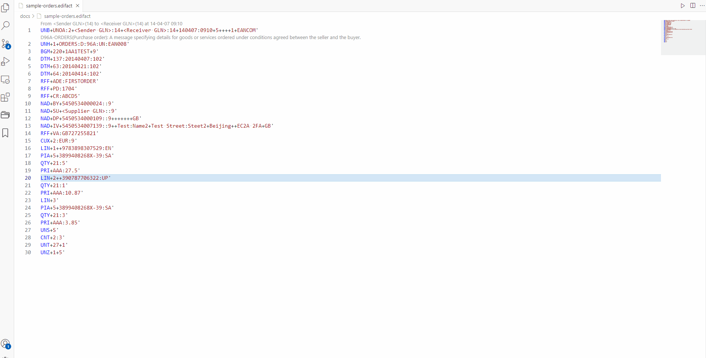
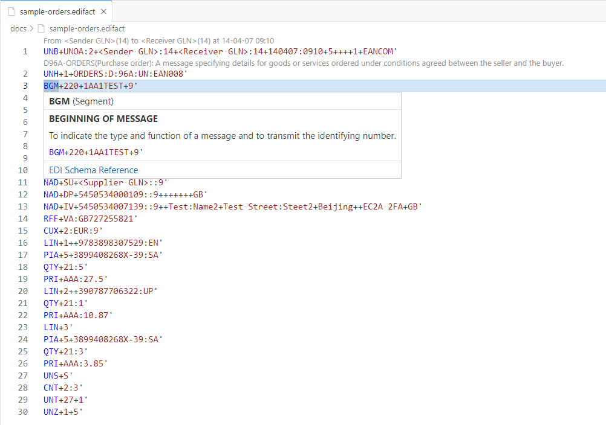
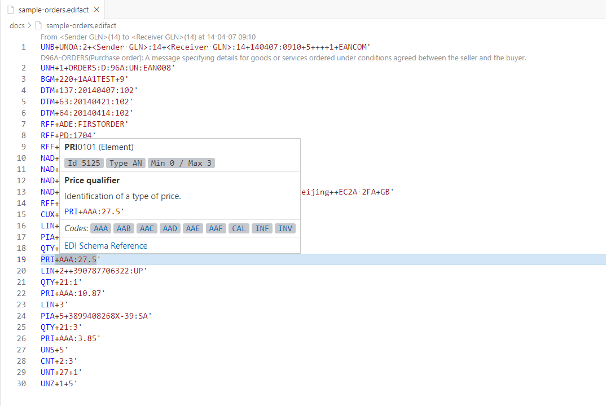

  <h1>EDI Support for VSCode</h1>

  
  
  
  
  

> ⚡This extension provides multiple supports for the ⚡X12 and ⚡EDIFACT document.

## 👍 Features

- Basic syntax highlighting.
- 💥Document diagnostics.
- 💥Inlay hints for segments and elements.
- 💥Edi Explorer
- Document formatting.
- Document prettify.
- Document minify.
- Segment hover description.
- Element hover description.
- Document Symbols.

### Document diagnostics.

### Inlay hints for segments and elements.

### Edi Explorer.

### Document prettify.

### Document minify.

### Segment hover description.

### Element hover description.

## Reference
[知行软件 - kasoftware](https://www.kasoftware.com)

## About

GitHub: https://github.com/hellooops/vscode-edi-edifact-support

## Requirements

None right now.

## Extension Settings

Nothing at this point.

## Known Issues

None for now.

## License

Licensed under the [MIT](https://github.com/hellooops/vscode-edi-edifact-support/blob/main/LICENSE) License.