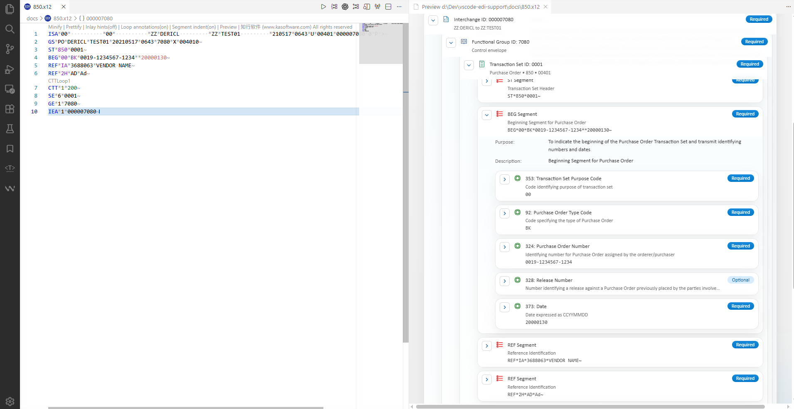
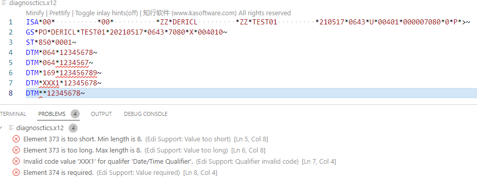
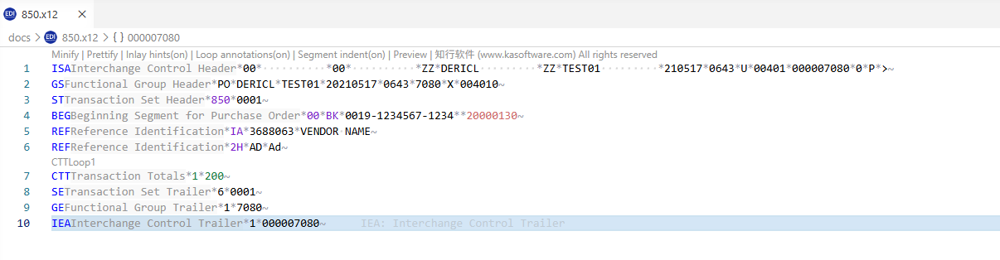
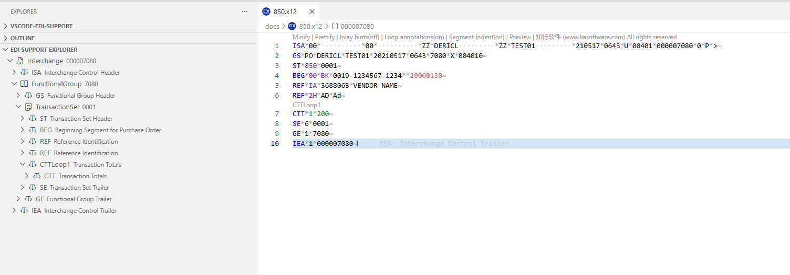
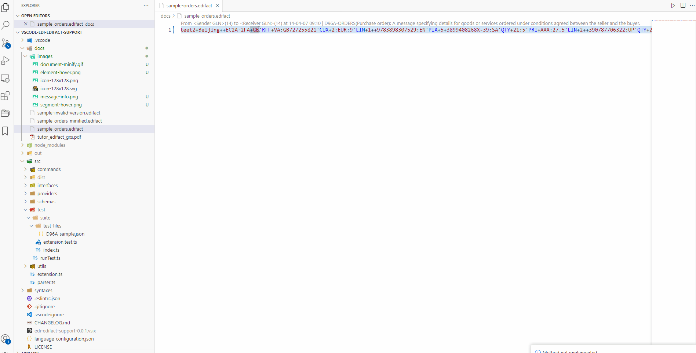
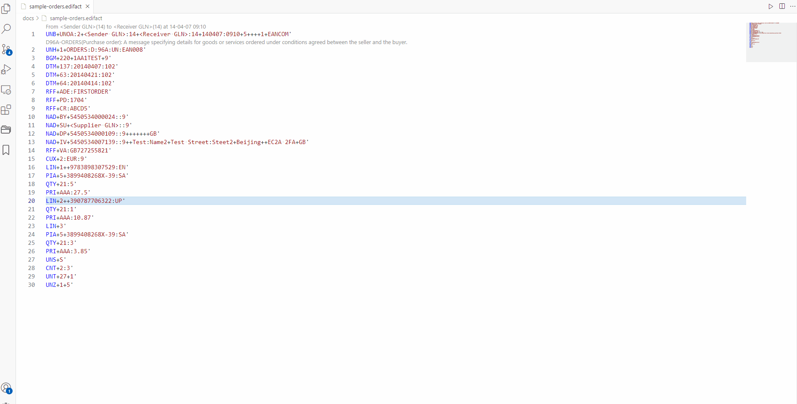
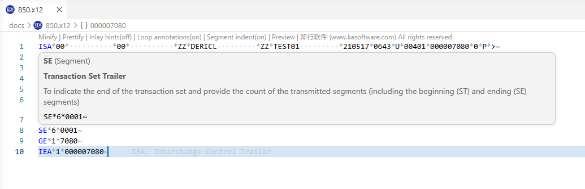
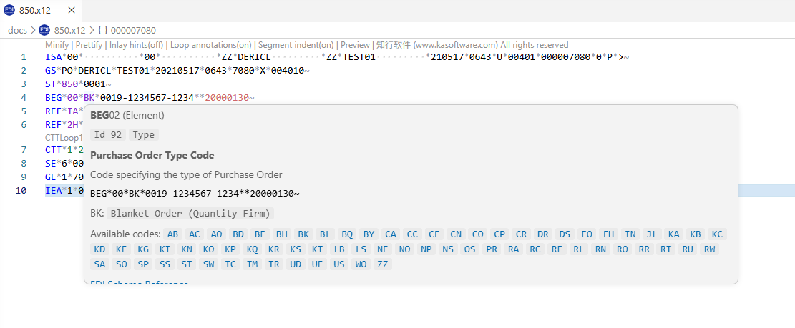

<div align="center">

  

  <h1>EDI Support for VSCode</h1>

  [](https://marketplace.visualstudio.com/items?itemName=DericLee.edi-edifact-support)
  [](https://marketplace.visualstudio.com/items?itemName=DericLee.edi-edifact-support)
  [](https://marketplace.visualstudio.com/items?itemName=DericLee.edi-edifact-support)
  [](https://marketplace.visualstudio.com/items?itemName=DericLee.edi-edifact-support)
  [](https://github.com/hellooops/vscode-edi-support)

  [](https://github.com/hellooops/vscode-edi-support/issues/new)

</div>

> ⚡This extension provides multiple supports for the ⚡X12 and ⚡EDIFACT document.


## 👍 Features

- 💥Preview EDI files.
- Basic syntax highlighting.
- Document diagnostics.
- Inlay hints for segments and elements.
- Edi Explorer
- Document formatting.
- Document prettify.
- Document minify.
- Segment hover description.
- Element hover description.
- Document Symbols.

## Repository structure

- `src/`: VS Code extension runtime, providers, commands and host-specific adapters.
- `packages/edi-parser/`: standalone parser package for X12, EDIFACT and VDA.
- `src/parser/` and `src/schemas/`: compatibility re-export layer for the extension and legacy internal imports.

## Reuse the parser core

The parser core has been extracted to [`packages/edi-parser`](./packages/edi-parser/README.md).

- Inside this repository, the extension consumes it through the local dependency `"edi-parser": "file:packages/edi-parser"`.
- Outside this repository, you can install the package folder directly and use it in a plain Node.js process without VS Code APIs.

```bash
npm install ./packages/edi-parser
```

```js
const { createParser, detectEdiType } = require("edi-parser");

const text = "ISA*00*          *00*          *ZZ*SENDER         *ZZ*RECEIVER       *241111*0300*U*00401*000000001*0*T*:~\nGS*PO*SENDER*RECEIVER*20241111*0300*1*X*004010~\nST*850*0001~\nSE*2*0001~\nGE*1*1~\nIEA*1*000000001~";

console.log(detectEdiType(text));
createParser(text)?.parse().then(document => {
  console.log(document?.interchanges.length);
});
```

For more package-level details, see [`packages/edi-parser/README.md`](./packages/edi-parser/README.md).


### Document preview.
<p></p>

### Document diagnostics.
<p></p>

### Inlay hints for segments and elements.
<p></p>

### Edi Explorer.
<p></p>

### Document prettify.

<p></p>

### Document minify.

<p></p>

### Segment hover description.

<p></p>

### Element hover description.

<p></p>

## Reference
[知行软件 - kasoftware](https://www.kasoftware.com)

## About

GitHub: https://github.com/hellooops/vscode-edi-edifact-support

## Requirements

None right now.

## Extension Settings

Nothing at this point.

## Known Issues

None for now.

## License

Licensed under the [MIT](https://github.com/hellooops/vscode-edi-edifact-support/blob/main/LICENSE) License.
